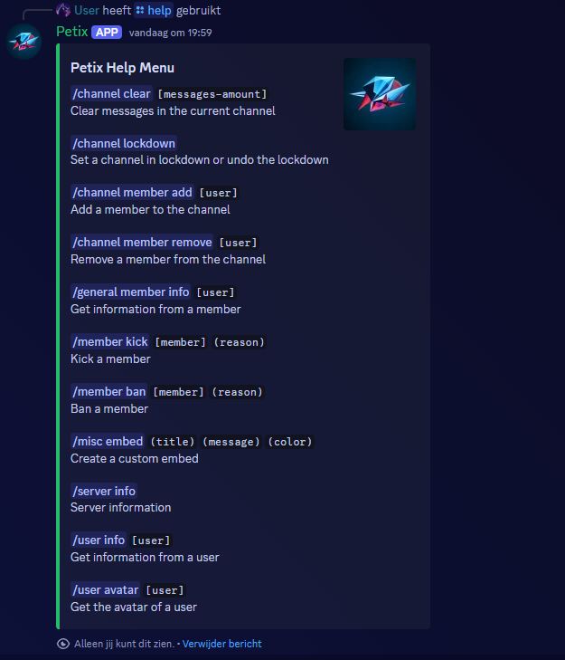

# Petix

[](https://github.com/Jonathan25J/Petix/releases/latest)
[](https://github.com/Jonathan25J/Petix/actions/workflows/docker-compose.yml)


The Petix bot/app is largely rebuild in version 2.0.0 so that the app still can be hosted without crashing each time. You can see the old and current functionality of this app in the provided images.

## Invite app
It's not possible to invite this app.

## Hosting
- Have the following software installed: `Node` and the `Docker Engine`
- Create a `.env` file in the root folder with the following content 
```bash
# App
APP_TOKEN = [APP TOKEN]
APP_CLIENT_ID = [APP CLIENT ID]
```
- Replace the values inside the brackets `[]` with your values and remove the brackets itself
- Run `docker compose up -d`
- Run `node deploy-commands`

## Images
### Version 2.0.0


### Version 1.0.0
